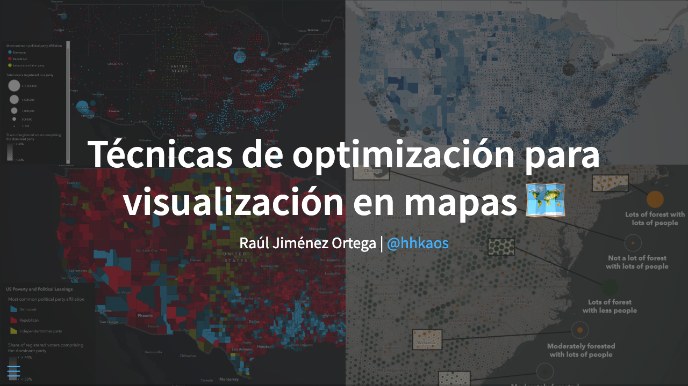

# Map visualization optimization techniques 🗺️

Slides:
* English: [Map visualization optimization techniques 🗺️](https://hhkaos.github.io/spatial-dataviz-optimization-techniques/index-en.html)
* Spanish: [Técnicas de optimización para visualización en mapas 🗺️](https://hhkaos.github.io/spatial-dataviz-optimization-techniques/)

## Run locally

Development mode:

`quarto preview /Users/ral97612/workspace/ppt-dataviz/ppt.qmd --no-browser --no-watch-inputs`

Build:

`quarto render /Users/ral97612/workspace/ppt-dataviz/ppt.qmd --to revealjs`