# { .center-title-slide .smallerTitle background-image="/imgs/1.tecnologias.png" background-size="contain" background-repeat="no-repeat" background-position="center"}

## Mapas estáticos { .center-title-slide .mt-32 .smallerTitle background-image="/imgs/slides-bg-2.png" background-size="contain" background-repeat="no-repeat" background-position="center"}

## {.smallerTitle background-image="/imgs/slides-bg.png" background-size="contain" background-repeat="no-repeat" background-position="center"}

::: {.panel-tabset}

### Ejemplos



### Código

[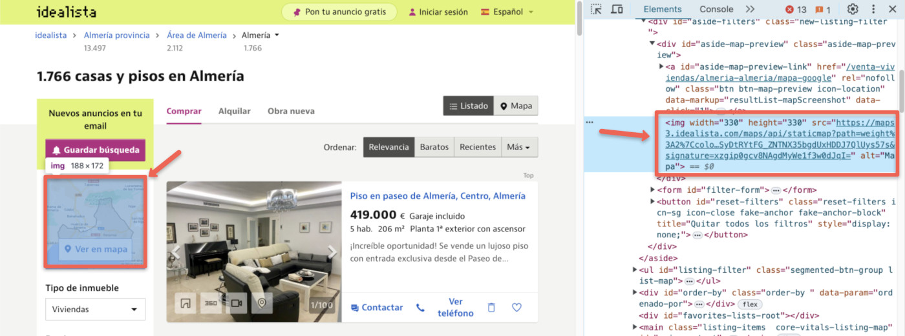](./imgs/static-map.jpg)

### Tecnologías

* [ArcGIS Static Maps Service (Beta)](https://earlyadopter.esri.com/key/static-maps)
* [Geoapify Static Maps API](https://www.geoapify.com/static-maps-api)
* [Google Map Static API](https://developers.google.com/maps/documentation/maps-static/overview)
* [Mapbox Static Images API](https://docs.mapbox.com/api/maps/static-images/)
* [MapTiler API](https://www.maptiler.com/cloud/static-maps/)
* [Mapquest Static Map API](https://developer.mapquest.com/documentation/api/static-map/)
* [Thunderforest Static Map API](https://www.thunderforest.com/docs/static-maps-api/)
* ...

::: {.notes}
Las posibilidades varian entre proveedores
:::

:::

## Mapas dinámicos {.smallerTitle .mt-32 background-image="/imgs/slides-bg-2.png" background-size="contain" background-repeat="no-repeat" background-position="center"}

## {.smallerTitle background-image="/imgs/slides-bg.png" background-size="contain" background-repeat="no-repeat" background-position="center"}

::: {.panel-tabset}

### Ejemplo

<iframe src="demos/amcharts-demo/dist/" style="width:100%;height:520px"></iframe>

### Código

[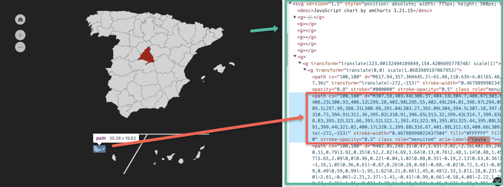](./imgs/svg-map.png)

### Tecnologías

* [amCharts](https://www.amcharts.com/demos/#maps)
* [Charts.js](https://www.sgratzl.com/chartjs-chart-geo/examples/)
* [D3.js geo](https://observablehq.com/@d3/gallery#maps)
* [Highcharts](https://www.highcharts.com/demo#highcharts-maps-demo-general)
* [jVectorMap](https://jvectormap.com/examples/world-gdp/)
* [Leaflet](https://leafletjs.com/)
* [Raphael.js (mapael)](https://www.vincentbroute.fr/mapael/)
* ...

:::

## Mapas interactivos {.smallerTitle .mt-32 background-image="/imgs/slides-bg-2.png" background-size="contain" background-repeat="no-repeat" background-position="center"}

## {.smallerTitle background-image="/imgs/slides-bg.png" background-size="contain" background-repeat="no-repeat" background-position="center"}

::: {.notes}
usan una combinación de canvas y SVG (Limitados a 2D. )
Hasta decenas de miles de puntos, cientos/miles de polígonos
combinar con herramientas de análisis espacial en el cliente (filtros espaciales), etc.
Buscador de direcciones. Mayores extensiones. Todos permiten mapas de fondo, mapas satélite, etc.
:::

::: {.panel-tabset}

### Ejemplo



### Código

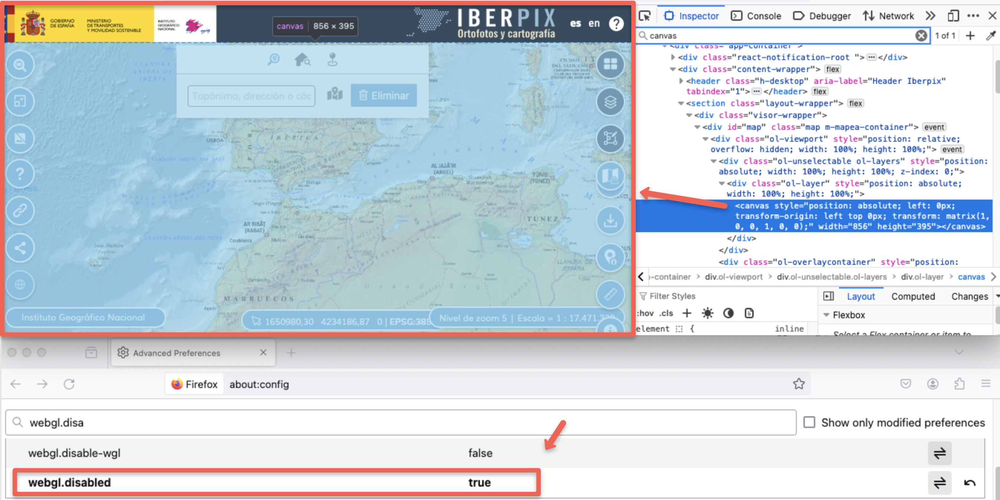

### Tecnologías

* [Google Maps JavaScript API](https://developers.google.com/maps/documentation/javascript)
* [Leaflet](https://leafletjs.com/)*
* [OpenLayers](https://openlayers.org/)
* [ArcGIS JS SDK 3.x](https://developers.arcgis.com/javascript/3/) (_deprecated_)

:::

## Mapas inmersivos {.center-title-slide .mt-32 background-image="/imgs/slides-bg-2.png" background-size="contain" background-repeat="no-repeat" background-position="center"}

## {.smallerTitle background-image="/imgs/slides-bg.png" background-size="contain" background-repeat="no-repeat" background-position="center"}

::: {.notes}
WebGL/OpenGL, mayor número de elementos, efectos tipo photoshop,  personalizar cambiar el estilo del mapa, rotarlo, 3D,
:::

::: {.panel-tabset}

### Ejemplo



### Código



### Tecnologías

* [ArcGIS Maps SDK for JavaScript 4.x](https://js.arcgis.com/)
* [Azure Maps](https://samples.azuremaps.com/)
* [CesiumJS](https://cesium.com/platform/cesiumjs/)
* [Deck.gl](https://docs.carto.com/carto-for-developers/carto-for-deck.gl)
* [HERE](https://developer.here.com/develop/javascript-api)
* [Kepler.gl](https://kepler.gl/)
* [Mapbox GL JS](https://docs.mapbox.com/mapbox-gl-js/api/) & [MapLibre GL JS](https://maplibre.org/maplibre-gl-js/docs/)
* [TomTom Maps SDK Web JS](https://developer.tomtom.com/maps-sdk-web-js/overview/product-information/introduction)

:::

# { .center-title-slide .smallerTitle background-image="/imgs/2.tiempos-de-carga.png" background-size="contain" background-repeat="no-repeat" background-position="center"}

## {.smallerTitle .center-grid background-image="/imgs/slides-bg.png" background-size="contain" background-repeat="no-repeat" background-position="center"}

Reduce los _bytes_ enviados por la red

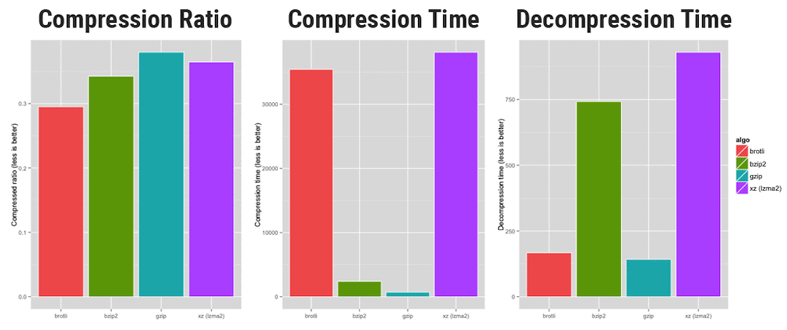

## {.smallerTitle .center-grid background-image="/imgs/slides-bg.png" background-size="contain" background-repeat="no-repeat" background-position="center"}

GeoJSON estándard ([RFC 7946](https://datatracker.ietf.org/doc/html/rfc7946)) 

[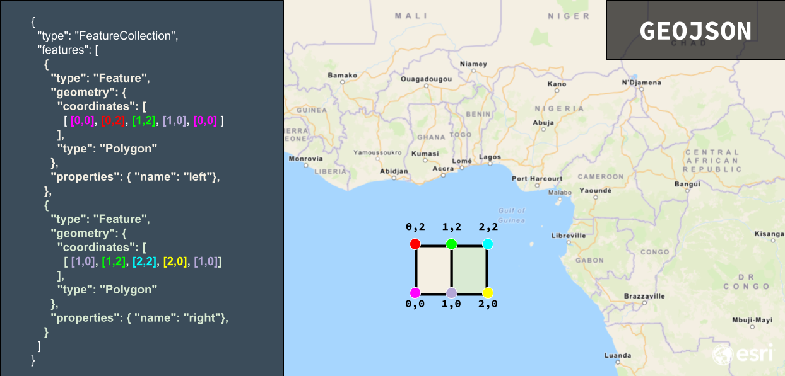](./imgs/geojson-explained.png){width="600"}

## {.smallerTitle .center-grid background-image="/imgs/slides-bg.png" background-size="contain" background-repeat="no-repeat" background-position="center"}

Reduce el tamaño del _dataset_

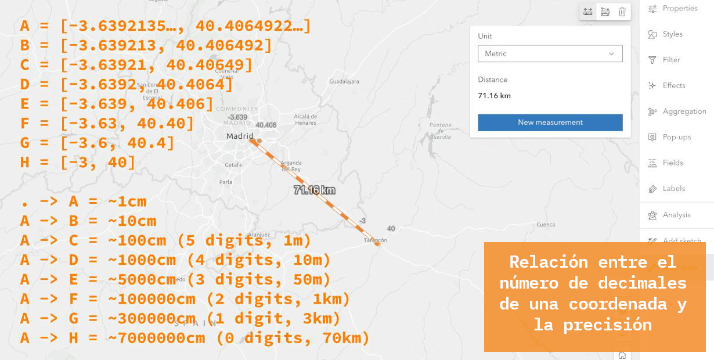

:::{.tiny}
> Y... por supuesto [no envíes propiedades que no necesites, elimina espacios, etc (uglify)](https://github.com/radical-data/reducegeojson)
:::

::: {.notes}
Las coordenadas GeoJSON suelen tener por defecto una precisión extrema, a menudo con 15-17 decimales, lo que equivale a una escala atómica. Para la mayoría de las aplicaciones prácticas, se puede reducir la precisión de las coordenadas a unos 6 decimales, lo que equivale aproximadamente a una escala de 1 cm. Esto reduce el tamaño del archivo sin comprometer la usabilidad.
:::

## {.smallerTitle .center-grid background-image="/imgs/slides-bg.png" background-size="contain" background-repeat="no-repeat" background-position="center"}

::: {.panel-tabset}

### TopoJSON

[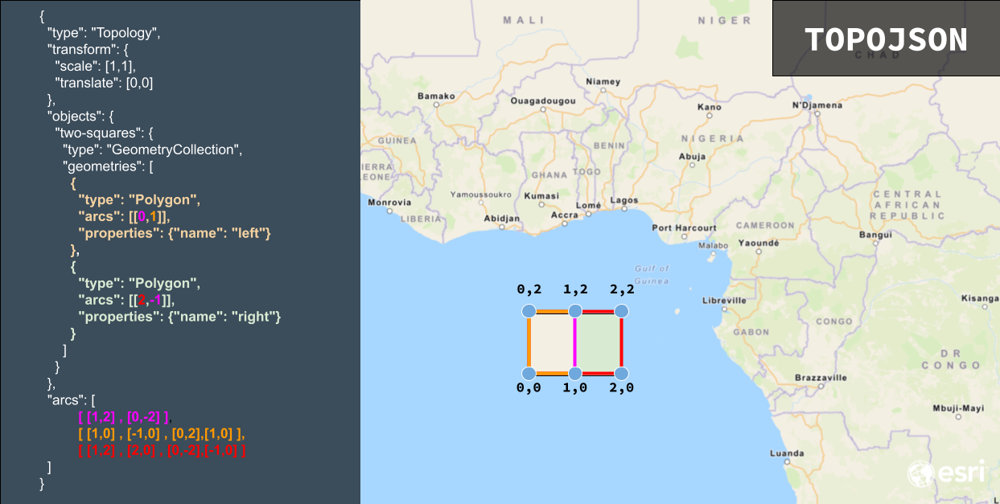](./imgs/topojson-explained.png)

### Convierte y simplifica

<iframe src="https://mapshaper.org/" style="width:100%;height:520px"></iframe>

:::

## {.smallerTitle .smaller .center-grid background-image="/imgs/slides-bg.png" background-size="contain" background-repeat="no-repeat" background-position="center"}

::: {.notes}
Data Chunking y visualizaciones sensibles a la escala
:::

::: {.panel-tabset}

### Teselado

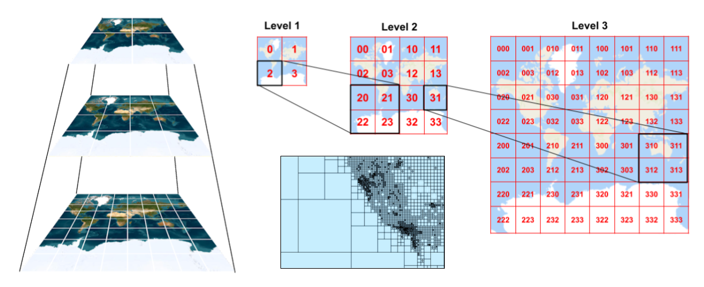

### FeatureLayer

<iframe src="/demos/arcgis-tiles/arcgis-js-sdk-feature-layers.html"  style="width:100%;height:520px"></iframe>

### Vector

<iframe src="/demos/arcgis-tiles/arcgis-js-sdk-vt.html"  style="width:100%;height:520px"></iframe>

### Raster

<iframe src="/demos/arcgis-tiles/arcgis-js-sdk-raster.html"  style="width:100%;height:520px"></iframe>

### Tecnologías

* [ArcGIS Data Hosting](https://developers.arcgis.com/documentation/mapping-apis-and-services/data-hosting/)
* [GeoServer](http://geoserver.org/)
* [Koop](https://www.osgeo.org/projects/koop/)
* [Mapbox Tiling Service](https://www.mapbox.com/mts)
* [MapTiler GeoData Hosting](https://www.maptiler.com/cloud/geodata-hosting/)
* [MapServer](https://mapserver.org/)
* [Martin](https://github.com/maplibre/martin)
* [Tegola](https://github.com/go-spatial/tegola)

:::

## Cachea, cachea, cachea! {.smallerTitle .center  .center-title-slide background-image="/imgs/slides-bg.png" background-size="contain" background-repeat="no-repeat" background-position="center"}

:::widthAutoCenter
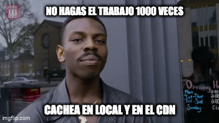
:::

## Crea índices espaciales{.smaller .smallerTitle .center  .center-title-slide background-image="/imgs/slides-bg.png" background-size="contain" background-repeat="no-repeat" background-position="center"}

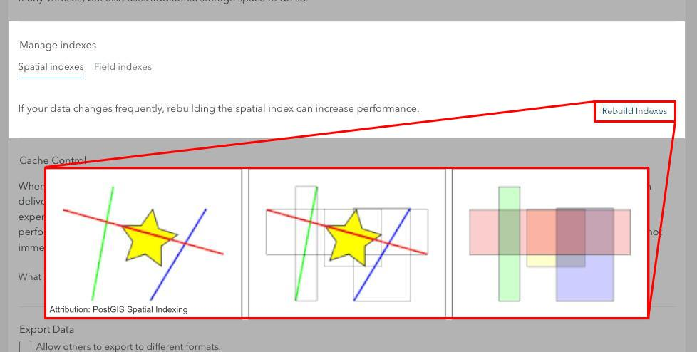

<!-- ## Streaming de datos -->

# { .center-title-slide .smallerTitle background-image="/imgs/3-fluidez-de-la-interaccion.png" background-size="contain" background-repeat="no-repeat" background-position="center"}

::: {.notes}
Optimizar la renderización/pintado (webgl, renderers)
Reducir los tiempos de respuesta (usa la info en el browser)
Usa WebGL para grandes cantidades de datos
Mueve la máxima cantidad al cliente
:::

## {.smallerTitle .smaller .center-grid background-image="/imgs/slides-bg.png" background-size="contain" background-repeat="no-repeat" background-position="center"}

:::{.notes}
clustering. para datos de tipo punto
:::

::: {.panel-tabset}

### Intro



### C. Predominante

<iframe src="https://developers.arcgis.com/javascript/latest/sample-code/featurereduction-cluster-query/live/" style="width:100%;height:500px"></iframe>

### Estadísticas

<iframe src="https://developers.arcgis.com/javascript/latest/sample-code/featurereduction-cluster-filter-slider/live/" style="width:100%;height:500px"></iframe>

### Variables visuales

<iframe src="https://developers.arcgis.com/javascript/latest/sample-code/featurereduction-cluster-visualvariables/live/" style="width:100%;height:500px"></iframe>

### Gráfico circular

<iframe src="https://developers.arcgis.com/javascript/latest/sample-code/featurereduction-cluster-pie-charts/live/" style="width:100%;height:500px"></iframe>

:::

## {.smallerTitle .smaller .center-grid background-image="/imgs/slides-bg.png" background-size="contain" background-repeat="no-repeat" background-position="center"}

:::{.notes}
Heatmaps 🔥 
:::

::: {.panel-tabset}

### Intro

[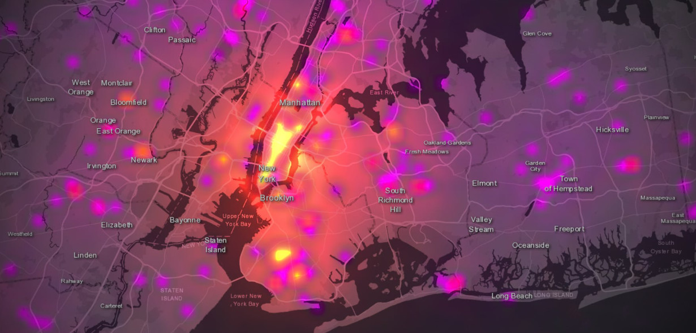](https://www.esri.com/arcgis-blog/products/arcgis-online/mapping/next-generation-heat-maps-mapviewer/)

### Dinámico

<iframe src="https://developers.arcgis.com/javascript/latest/sample-code/visualization-heatmap-scale/live/" style="width:100%;height:500px"></iframe>

### Estático

<iframe src="https://developers.arcgis.com/javascript/latest/sample-code/visualization-heatmap-static/live/" style="width:100%;height:500px"></iframe>

### 3D

<iframe src="https://developers.arcgis.com/javascript/latest/sample-code/visualization-heatmap-scene/live/" style="width:100%;height:500px"></iframe>

:::

## {.smallerTitle .smaller .center-grid background-image="/imgs/slides-bg.png" background-size="contain" background-repeat="no-repeat" background-position="center"}

:::{.notes}
Binning 📦
:::

::: {.panel-tabset}

### Intro

<iframe src="https://developers.arcgis.com/javascript/latest/demo-apps/visualization-demos-high-density-binning-swipe-2ddd3e70b27990d90548d6e62d91d373.html" style="width:100%;height:500px"></iframe>

### Simple

<iframe src="https://developers.arcgis.com/javascript/latest/sample-code/featurereduction-binning/live/" style="width:100%;height:500px"></iframe>

### Estadísticas

<iframe src="https://developers.arcgis.com/javascript/latest/sample-code/featurereduction-binning-arcade-summary/live/" style="width:100%;height:500px"></iframe>

:::

## {.smallerTitle .smaller .center-grid background-image="/imgs/slides-bg.png" background-size="contain" background-repeat="no-repeat" background-position="center"}

:::{.notes}
Haz todo lo que puedas en el cliente
:::

::: {.panel-tabset}

### Análisis espacial

<iframe src="https://developers.arcgis.com/documentation/demo-apps/spatial-analysis-services-code-geometry-analysis-spatial-relationships-demo-fe67e3268dff6aef7d1af1ad4d8ef649.html"  style="width:100%;height:500px"></iframe>

### Cálculos geométricos

<iframe src="https://developers.arcgis.com/documentation/demo-apps/spatial-analysis-services-code-geometry-analysis-geometry-calculations-demo-4a4a8314c4452a064e56340bd1497450.html"  style="width:100%;height:500px"></iframe>

### Estadísticas

<iframe src="https://developers.arcgis.com/javascript/latest/sample-code/featurelayerview-query-geometry/live/"  style="width:100%;height:500px"></iframe>

### Filtrado

<iframe src="https://developers.arcgis.com/javascript/latest/sample-code/layers-imagery-pixelvalues/live/"  style="width:100%;height:500px"></iframe>

### Pixel

<iframe src="https://developers.arcgis.com/javascript/latest/sample-code/layers-imagery-clientside/live/"  style="width:100%;height:500px"></iframe>

:::

:::{.notes}
usando blending
:::

# { .center-title-slide .smallerTitle background-image="/imgs/4.costes.png" background-size="contain" background-repeat="no-repeat" background-position="center"}

## Open data {.center-grid .mt-7 background-image="/imgs/slides-bg.png" background-size="contain" background-repeat="no-repeat" background-position="center"}

* [amCharts geodata](https://www.amcharts.com/dl/amcharts5-geodata/)
* [ArcGIS Hub](hub.arcgis.com)
* [Datos abiertos del Gobierno de España](https://datos.gob.es/es/)
* [Free SVG Maps](https://www.amcharts.com/svg-maps/)
* [Infraestructuras de Datos Espaciales](https://es.wikipedia.org/wiki/Infraestructura_de_datos_espaciales) (e.g. [IGN](https://www.ign.es/web/cbg-area-cartografia))
* [OpenStreetMap](https://wiki.openstreetmap.org/)
* ...

## Dataviz{.center-grid .mt-3 background-image="/imgs/slides-bg.png" background-size="contain" background-repeat="no-repeat" background-position="center"}

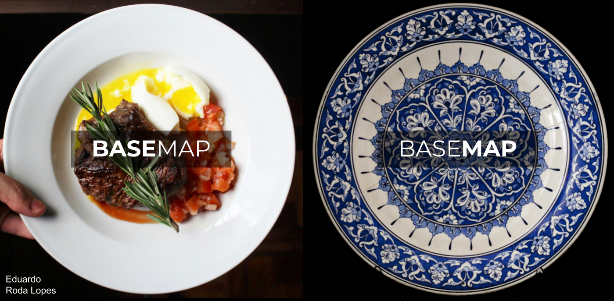

## Dataviz{.center-grid .mt-3 background-image="/imgs/slides-bg.png" background-size="contain" background-repeat="no-repeat" background-position="center"}

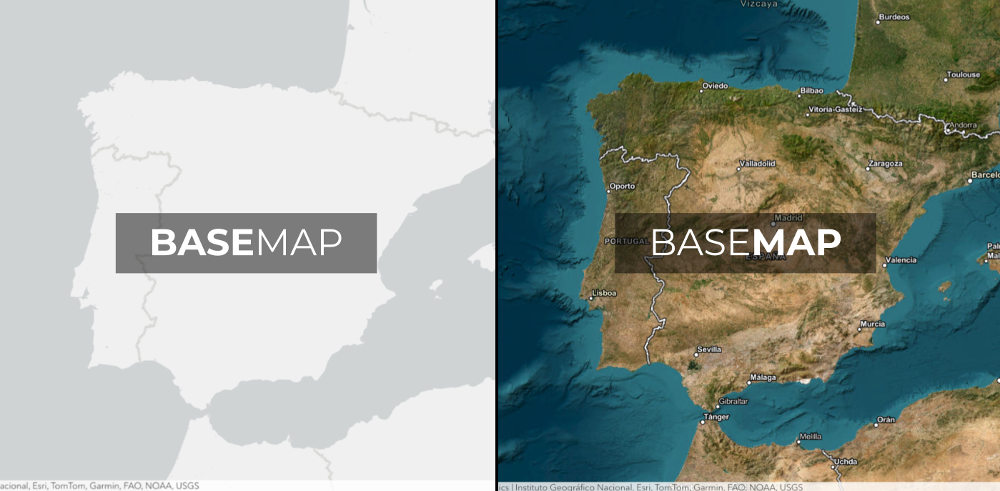

##  {background-video="./video/protomaps.mp4" background-size="contain"}

<!--  -->

